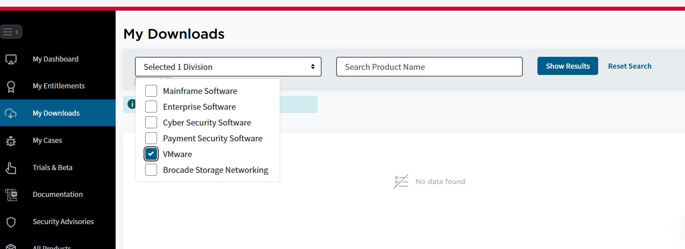
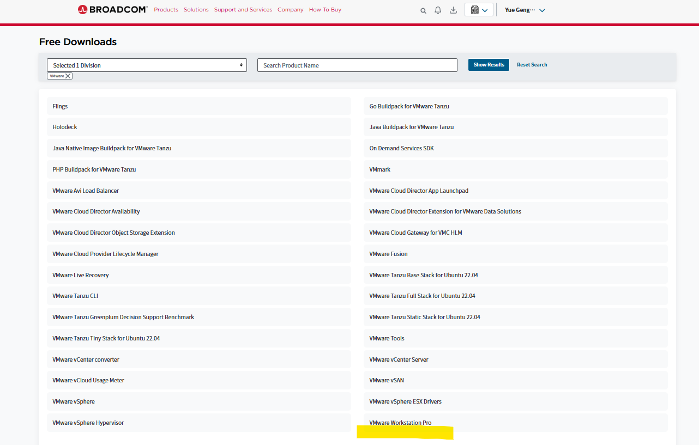
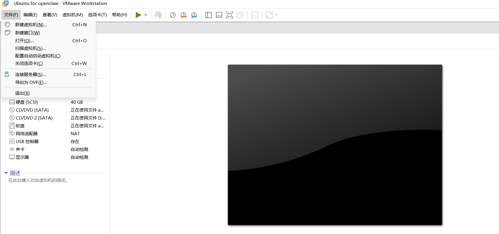

# AI4S 工作区操作手册

## 1. 主要文件

- `openclaw.sh`：主启动脚本，按院所逐个生成问卷答卷和评分 JSON。
- `院内科研单位AI4S“就绪度”调查问卷.docx`：源问卷。
- `.openclaw_helpers/`：提示词、校验脚本和格式整理脚本。
- `result/`：最终输出目录。
- `logs/`：日志目录。
- `README.md`：本操作手册。

## 2. VMware Workstation Pro虚拟机软件安装(不使用虚拟机可以跳过2和3)

https://www.vmware.com/

需要在官网注册。注册后在My Downloads里选择 VMWare并搜索。如下图


如下图选择 VMware Workstation Pro 并下载

安装完成vMware后打开虚拟机文件，如下图打开：

导入OVF文件，创建新的虚拟机

## 2. 登录和进入目录

```bash
cd /home/updating/.openclaw/workspace/ai4sci
```

## 3. 一键启动

```bash
bash openclaw.sh
```

脚本会自动：
- 逐个处理脚本里配置的各个院所；
- 调用 `openclaw agent` 进行资料检索、问卷生成和补全；
- 校验 Word 问卷题号覆盖和 JSON 评分格式；
- 输出最终的答卷docx文件和JSON评分文件，把它们放到 `result/`。

## 4. 查看结果

```bash
ls -lh result
```

每个院所正常会有两类文件：

```text
result/问卷_格式整理_中科院xx所.docx
result/单选题答案_中科院xx所.json
```

文件名后缀会换成对应院所名称。

## 5. 断点续跑

直接重新执行：

```bash
bash openclaw.sh
```

脚本会检查 `result/` 中已有的 Word 和 JSON。如果文件存在且校验通过，就跳过该院所；如果校验失败，会删除对应旧结果并重新生成。

如果想从头重跑某个院所，删除该院所对应的两个结果文件，再启动脚本

## 6. 调整单个 agent 超时时间

默认每次 `openclaw agent` 调用超时时间是 21600 秒，即 6 小时。需要更长时间时,调整 `OPENCLAW_AGENT_TIMEOUT_SECONDS`变量编码的最长等待秒数

## 7. 注意事项

- 脚本运行过程中生成的中间文件会放在根目录中，每个院所跑完后会删除中间文件。所以不要把重要文件放在工作区根目录。脚本每轮会清理根目录下不在白名单里的文件。
